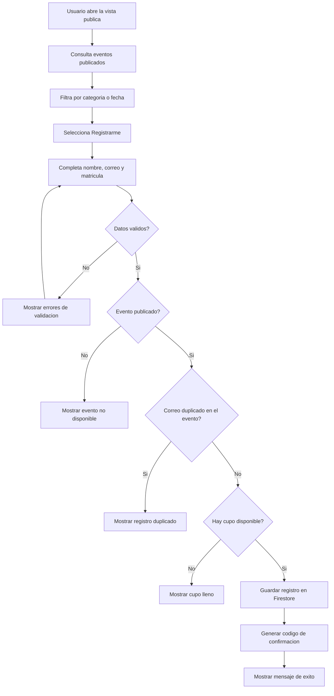

# Diagrama de flujo del registro a un evento

```mermaid
flowchart TD
  A["Usuario abre la vista publica"] --> B["Consulta eventos publicados"]
  B --> C["Filtra por categoria o fecha"]
  C --> D["Selecciona Registrarme"]
  D --> E["Completa nombre, correo y matricula"]
  E --> F{"Datos validos?"}
  F -- No --> G["Mostrar errores de validacion"]
  G --> E
  F -- Si --> H{"Evento publicado?"}
  H -- No --> I["Mostrar evento no disponible"]
  H -- Si --> J{"Correo duplicado en el evento?"}
  J -- Si --> K["Mostrar registro duplicado"]
  J -- No --> L{"Hay cupo disponible?"}
  L -- No --> M["Mostrar cupo lleno"]
  L -- Si --> N["Guardar registro en Firestore"]
  N --> O["Generar codigo de confirmacion"]
  O --> P["Mostrar mensaje de exito"]
```
